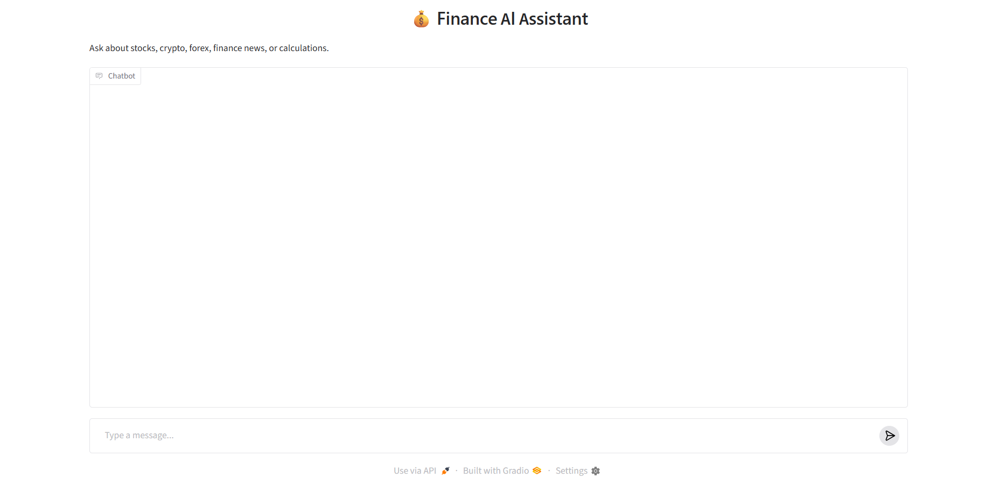
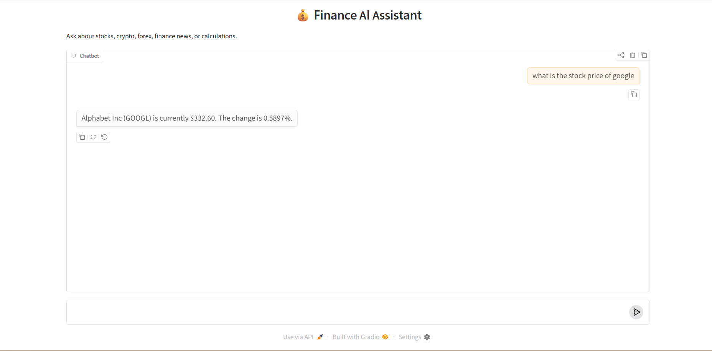
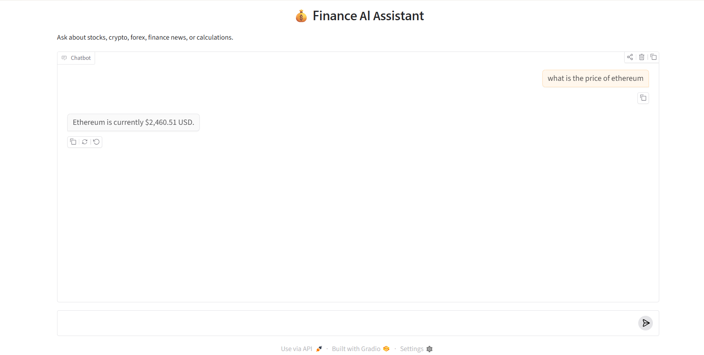
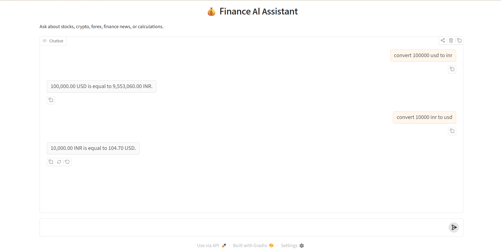
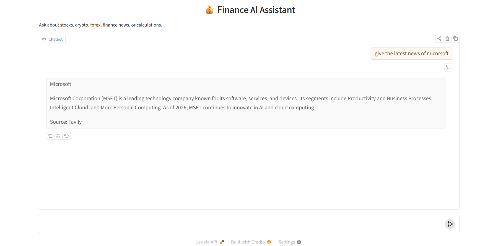
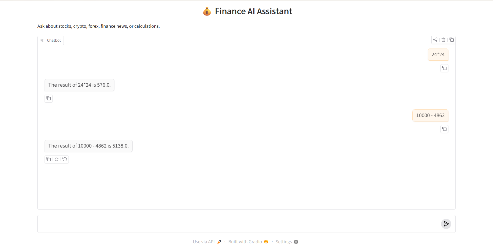
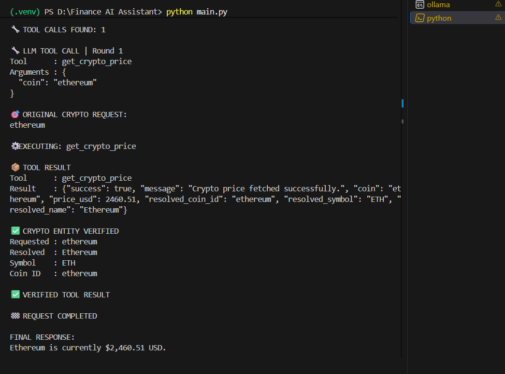

# 💰 Finance AI Assistant

An AI-powered financial assistant built with **Python, Ollama, Gradio, Pydantic, and external financial APIs**.

The application allows users to interact with financial information using natural language. Instead of relying on the LLM to generate financial numbers from its own knowledge, the assistant uses **tool calling** to retrieve current data from external services and perform exact calculations.

The project is designed around a modular architecture where the **Ollama-powered AI model decides which tool should be used**, while dedicated Python services handle the actual financial operations.

---

## 📌 Overview

The **Finance AI Assistant** can answer questions about:

* 📈 Stock prices
* ₿ Cryptocurrency prices
* 💱 Currency conversion
* 🧮 Mathematical calculations
* 📰 Current/recent financial news
* 🕐 Current date and time
* 💬 Conversation memory
* 🛡️ Basic safety filtering
* 🔧 Tool selection and execution
* ✅ Tool argument validation
* 🔍 Financial result validation

The application uses **Ollama** for local LLM inference, allowing the project to run without requiring an OpenAI API key.

### Basic flow

```text
User
  │
  ▼
Gradio Chat Interface
  │
  ▼
FinanceAssistant
  │
  ├── Safety Check
  │
  ├── Ollama LLM
  │       │
  │       ▼
  │   Tool Selection
  │
  ▼
Tool Manager
  │
  ├── Stock Service ───────► Finnhub
  │
  ├── Crypto Service ──────► CoinGecko
  │
  ├── Forex Service ───────► ExchangeRate-API
  │
  ├── Calculator Service
  │
  ├── News Service ────────► Tavily
  │
  └── DateTime Service
  │
  ▼
Validated Tool Result
  │
  ▼
Formatted Response
  │
  ▼
User
```

---

# ✨ Features

## 📈 Stock Price Lookup

Retrieve current stock information using a company ticker.

Example:

```text
What is Apple's stock price?
```

The assistant can identify the stock ticker and call:

```text
get_stock_price
```

The stock service retrieves:

* Company name
* Ticker
* Current price
* Percentage change

### Provider

**Finnhub**

---

## ₿ Cryptocurrency Price Lookup

Retrieve the current price of cryptocurrencies.

Example:

```text
What is the current price of Bitcoin?
```

The assistant uses:

```text
get_crypto_price
```

The application dynamically searches CoinGecko instead of maintaining a hard-coded cryptocurrency list.

The service resolves the requested cryptocurrency using:

* CoinGecko ID
* Symbol
* Name
* Similarity matching

It then retrieves the current USD price.

The application also validates that the cryptocurrency returned by the provider matches the cryptocurrency originally requested by the user.

### Provider

**CoinGecko**

---

## 💱 Currency Conversion

Convert an amount between currencies using the current exchange rate.

Example:

```text
Convert 100000 USD to INR
```

The assistant calls:

```text
convert_currency
```

Required arguments:

```text
amount
from_currency
to_currency
```

Example tool arguments:

```json
{
  "amount": 100000,
  "from_currency": "USD",
  "to_currency": "INR"
}
```

### Provider

**ExchangeRate-API**

---

## 🧮 Calculator

The assistant can perform mathematical calculations.

Example:

```text
Calculate 125 * 30
```

or:

```text
Calculate sqrt(144)
```

The calculator supports functions such as:

* `abs`
* `round`
* `pow`
* `sqrt`

The calculator is implemented as a dedicated service rather than asking the LLM to perform the numerical calculation itself.

---

## 📰 Financial News

Retrieve current/recent financial news about a financial topic.

Example:

```text
Give me the latest finance news about Tesla.
```

The assistant calls:

```text
get_finance_news
```

The news service uses Tavily to search for financial information and returns a summarized result.

### Provider

**Tavily**

---

## 🕐 Current Date and Time

The assistant can retrieve the actual current date and time.

Example:

```text
What is today's date?
```

The assistant calls:

```text
get_current_datetime
```

The result contains:

* Date
* Day
* Time

---

# 🧠 AI and Tool Calling

The project uses **Ollama** for local LLM inference.

The default model configured by the project is:

```text
llama3.2:1b
```

The Ollama server is expected to run at:

```text
http://localhost:11434
```

The assistant sends the available tools to Ollama.

The model determines which tool is appropriate for the user's request.

For example:

```text
User:
What is the price of Bitcoin?
```

The model should select:

```text
get_crypto_price
```

The tool manager then executes the corresponding Python service.

This separates:

```text
AI reasoning
```

from:

```text
actual financial data retrieval
```

---

# 🛠️ Available Tools

| Tool                   | Purpose                            | Data Source      |
| ---------------------- | ---------------------------------- | ---------------- |
| `get_stock_price`      | Current public company stock price | Finnhub          |
| `get_crypto_price`     | Current cryptocurrency price       | CoinGecko        |
| `convert_currency`     | Currency conversion                | ExchangeRate-API |
| `calculate`            | Mathematical calculations          | Local Python     |
| `get_finance_news`     | Current/recent financial news      | Tavily           |
| `get_current_datetime` | Current date and time              | Local Python     |

---

# 🏗️ System Architecture

```text
┌───────────────────────────────┐
│       Gradio Chat UI          │
└───────────────┬───────────────┘
                │
                ▼
┌───────────────────────────────┐
│       FinanceAssistant        │
│                               │
│  • Safety                     │
│  • Memory                     │
│  • Ollama                     │
│  • Tool selection             │
│  • Argument validation        │
│  • Result validation          │
└───────────────┬───────────────┘
                │
                ▼
┌───────────────────────────────┐
│         ToolManager           │
└───────────────┬───────────────┘
                │
       ┌────────┼────────┐
       │        │        │
       ▼        ▼        ▼
    Stock    Crypto    Forex
    Service  Service   Service
       │        │        │
       ▼        ▼        ▼
   Finnhub  CoinGecko ExchangeRate
       
       ┌────────────┬──────────────┐
       │            │              │
       ▼            ▼              ▼
 Calculator       News         DateTime
 Service         Service        Service
                    │
                    ▼
                  Tavily
```

---

# 🔄 Request Processing Flow

When a user sends a message, the application follows this general process:

### 1. User sends a request

Example:

```text
Convert 500 USD to INR
```

### 2. Safety check

The request is checked against the application's local safety patterns.

### 3. Current request becomes authoritative

The assistant intentionally treats the **current user request as the highest-priority source** for tool selection and arguments.

This prevents previous conversation values from incorrectly influencing a new financial request.

For example:

```text
Previous:
Convert 90000 USD to INR

Current:
Convert 100000 USD to INR
```

The assistant must use:

```text
100000
```

and not reuse:

```text
90000
```

### 4. Ollama selects the appropriate tool

The model determines that the request requires:

```text
convert_currency
```

### 5. Arguments are validated

The application checks that the tool received valid concrete arguments.

### 6. Tool is executed

`ToolManager` routes the request to:

```text
ForexService
```

### 7. External provider returns data

ExchangeRate-API provides the conversion result.

### 8. Result is validated

The application checks that the returned result is valid.

### 9. Result is formatted

The application creates a deterministic user-facing response.

Example:

```text
500.00 USD is equal to 41,xxx.xx INR.
```

### 10. Conversation memory is updated

The user request and final assistant response are stored in the in-memory conversation history.

---

# 🛡️ Safety

The application contains a local safety filter implemented in:

```text
app/safety.py
```

The filter checks incoming messages against blocked patterns involving requests such as:

* Hacking
* Malware
* Ransomware
* Credential theft
* Credit card fraud
* Financial fraud
* Phishing attacks

If a request matches a blocked pattern, the assistant refuses the request instead of passing it to the LLM/tool system.

This provides a lightweight local safety layer without requiring an external moderation API.

---

# 🔍 Financial Data Reliability

A major design goal of this project is to avoid allowing the LLM to invent financial numbers.

For requests involving current financial information, the assistant is instructed to use the appropriate external tool.

The application follows this principle:

```text
Current financial data
        ↓
External provider
        ↓
Validated result
        ↓
Formatted response
```

Instead of:

```text
User question
        ↓
LLM memory
        ↓
Potentially outdated number
```

The assistant also contains validation logic for tool arguments and results.

---

# ₿ Cryptocurrency Result Verification

Cryptocurrency handling contains additional validation because cryptocurrency names and symbols can be ambiguous.

The application dynamically resolves the requested cryptocurrency through CoinGecko.

It checks:

```text
Requested cryptocurrency
        ↓
CoinGecko result
        ↓
Coin ID
Symbol
Name
        ↓
Entity comparison
        ↓
Verified result
```

If the returned cryptocurrency does not sufficiently match the originally requested asset, the application does not accept the result.

This helps prevent a situation where:

```text
User asks:
Bitcoin
```

but the provider result is incorrectly treated as another cryptocurrency.

The application does not maintain a hard-coded cryptocurrency alias list.

---

# 🧠 Conversation Memory

Conversation memory is implemented in:

```text
app/memory.py
```

The `Memory` class stores:

```text
user messages
assistant responses
```

using the Pydantic `ChatMessage` model.

Memory can be:

```text
add_message()
get_messages()
clear()
```

The current implementation uses **in-memory conversation storage**, meaning the conversation is not persisted to a database.

---

# 📦 Project Structure

```text
Finance AI Assistant/
│
├── app/
│   ├── __init__.py
│   ├── assistant.py
│   ├── config.py
│   ├── memory.py
│   ├── models.py
│   ├── safety.py
│   ├── tool_manager.py
│   │
│   ├── services/
│   │   ├── __init__.py
│   │   ├── base_service.py
│   │   ├── calculator_service.py
│   │   ├── crypto_service.py
│   │   ├── datetime_service.py
│   │   ├── forex_service.py
│   │   ├── news_service.py
│   │   └── stock_service.py
│   │
│   └── tools/
│       ├── __init__.py
│       └── definitions.py
│
├── test/
│   └── test_ollama.py
│
├── .env
├── .env.example
├── .gitignore
├── main.py
├── README.md
└── requirements.txt
```

> `__pycache__` directories are generated Python runtime files and should not be committed to GitHub.

---

# 📁 Main Components

## `main.py`

Application entry point.

Responsibilities:

* Creates the `FinanceAssistant`
* Defines the system prompt
* Creates the Gradio interface
* Handles user messages
* Launches the application

Run the application using:

```bash
python main.py
```

---

## `app/assistant.py`

The main AI orchestration layer.

Responsibilities include:

* Connecting to Ollama
* Sending tools to the model
* Processing tool calls
* Validating tool arguments
* Executing tools
* Validating tool results
* Cryptocurrency entity verification
* Formatting results
* Managing conversation memory
* Handling retry logic
* Preventing unsupported financial answers

This is the central component of the application.

---

## `app/tool_manager.py`

Acts as the bridge between the AI assistant and the individual services.

It routes tool calls such as:

```text
get_stock_price
```

to:

```text
StockService
```

and:

```text
get_crypto_price
```

to:

```text
CryptoService
```

This keeps tool execution separate from the AI orchestration layer.

---

## `app/tools/definitions.py`

Contains the tool definitions supplied to Ollama.

The definitions describe:

* Tool name
* Tool purpose
* Parameters
* Required arguments
* When the tool should or should not be used

---

## `app/models.py`

Contains Pydantic response models.

Models include:

```text
ToolResponse
StockQuote
CryptoPrice
ForexRate
CalculationResult
NewsResult
DateTimeResponse
ChatMessage
```

Using structured models makes tool results easier to validate and format.

---

# 🌐 External APIs

The project integrates with several external services.

| Service          | Purpose                  |
| ---------------- | ------------------------ |
| Finnhub          | Stock market data        |
| CoinGecko        | Cryptocurrency data      |
| ExchangeRate-API | Currency conversion      |
| Tavily           | Financial news search    |
| Ollama           | Local AI model inference |

---

# 💻 Technology Stack

### Programming Language

* Python

### AI / LLM

* Ollama
* `llama3.2:1b` by default

### User Interface

* Gradio

### Data Validation

* Pydantic

### HTTP Requests

* Requests

### Configuration

* python-dotenv

### Financial Data

* Finnhub
* CoinGecko
* ExchangeRate-API
* Tavily

---

# ⚙️ Requirements

Before running the project, install:

* Python 3.10+
* Ollama
* An Ollama model
* API keys for the external services

The project requirements are defined in:

```text
requirements.txt
```

---

# 🚀 Installation

## 1. Clone the repository

```bash
git clone https://github.com/your-username/finance-ai-assistant.git
```

Move into the project:

```bash
cd finance-ai-assistant
```

---

## 2. Create a virtual environment

Windows:

```powershell
python -m venv .venv
```

Activate it:

```powershell
.venv\Scripts\activate
```

Linux/macOS:

```bash
python3 -m venv .venv
source .venv/bin/activate
```

---

## 3. Install dependencies

```bash
pip install -r requirements.txt
```

---

# 🦙 Ollama Setup

Install Ollama and make sure the Ollama server is running.

Verify Ollama:

```bash
ollama version
```

The project is configured to use:

```text
http://localhost:11434
```

Pull the default model:

```bash
ollama pull llama3.2:1b
```

Verify installed models:

```bash
ollama list
```

You should see:

```text
llama3.2:1b
```

---

# 🔐 Environment Configuration

Create a `.env` file in the project root.

Use `.env.example` as the template.

Example:

```env
FINNHUB_API_KEY=your_finnhub_api_key
TAVILY_API_KEY=your_tavily_api_key
EXCHANGERATE_API_KEY=your_exchangerate_api_key

OLLAMA_HOST=http://localhost:11434
OLLAMA_MODEL=llama3.2:1b
```

### Important

Never commit your real `.env` file to GitHub.

Your `.gitignore` should exclude:

```text
.env
```

Use:

```text
.env.example
```

for sharing the required environment variable names.

---

# ▶️ Running the Application

Make sure the virtual environment is activated.

Then run:

```bash
python main.py
```

The Gradio application will start.

Open the local Gradio URL displayed in the terminal.

The interface will display:

```text
💰 Finance AI Assistant
```

with a chat interface for asking financial questions.

---

# 💬 Example Queries

## Stock

```text
What is Apple's current stock price?
```

```text
What is Microsoft's stock price?
```

```text
Show me Tesla's stock price.
```

---

## Cryptocurrency

```text
What is the current price of Bitcoin?
```

```text
What is Ethereum trading at?
```

```text
What is the current price of Solana?
```

---

## Currency Conversion

```text
Convert 100 USD to INR.
```

```text
Convert 500 EUR to USD.
```

```text
Convert 100000 USD to INR.
```

---

## Calculator

```text
Calculate 125 * 30.
```

```text
Calculate 1000 / 8.
```

```text
Calculate sqrt(144).
```

---

## Finance News

```text
Give me the latest finance news about Tesla.
```

```text
What is the latest financial news about Bitcoin?
```

```text
Give me recent news about the stock market.
```

---

## Date and Time

```text
What is the current date?
```

```text
What time is it?
```

---

# 🧪 Ollama Tool Calling Test

The project contains:

```text
test/test_ollama.py
```

This file performs a basic test of Ollama tool calling using:

```text
get_stock_price
```

Run it with:

```bash
python test/test_ollama.py
```

The test verifies that Ollama can receive a tool definition and produce a tool call response.

---

# 🖼️ Screenshots

You can add project screenshots to demonstrate the application on GitHub.

Recommended structure:

```text
screenshots/
├── finance-assistant-home.png
├── stock-query.png
├── crypto-query.png
├── currency-conversion.png
├── finance-news.png
├── calculator.png
└── tool-calling.png
```

Then add them to this README.

### Main Interface





### Stock Query





### Cryptocurrency Query





### Currency Conversion





### Finance News





### Calculator




### Tool Calling





# 🔐 Security Considerations

## API Keys

API keys are loaded from environment variables.

The project uses:

```text
python-dotenv
```

to load configuration from `.env`.

Do not hard-code API keys inside Python files.

---

## `.env`

The following file should remain local:

```text
.env
```

Only the example configuration should be committed:

```text
.env.example
```

---

## External Data

Financial information comes from external providers.

The application does not treat the LLM's internal knowledge as the source of truth for current financial values.

---

# 🧩 Modular Service Architecture

Each major operation has its own service.

```text
app/services/
│
├── stock_service.py
├── crypto_service.py
├── forex_service.py
├── calculator_service.py
├── news_service.py
└── datetime_service.py
```

This makes the project easier to:

* Maintain
* Test
* Debug
* Extend
* Replace API providers
* Add new financial capabilities

For example, cryptocurrency functionality is isolated inside:

```text
CryptoService
```

while stock functionality is isolated inside:

```text
StockService
```

---

# 🔄 Provider-Agnostic LLM Configuration

The application keeps the Ollama configuration in:

```text
app/config.py
```

The model and host are loaded from environment variables:

```env
OLLAMA_HOST=http://localhost:11434
OLLAMA_MODEL=llama3.2:1b
```

This means the Ollama model can be changed without modifying the main application architecture.

For example:

```env
OLLAMA_MODEL=another-ollama-model
```

provided that the selected model supports the required functionality.

---

# 🧱 Design Principles

The project follows several important design principles.

### 1. Separation of concerns

The AI assistant does not directly contain all financial API logic.

Instead:

```text
Assistant
    ↓
ToolManager
    ↓
Service
    ↓
External API
```

---

### 2. Structured responses

Financial services return Pydantic models rather than arbitrary strings.

For example:

```text
StockQuote
CryptoPrice
ForexRate
CalculationResult
NewsResult
```

This makes results predictable and easier to validate.

---

### 3. Current request priority

The current user request has priority over previous conversation context when determining financial tool arguments.

This reduces accidental reuse of:

* Old amounts
* Old currencies
* Old tickers
* Old cryptocurrencies
* Old tool arguments

---

### 4. No fabricated financial values

When a current financial value is required, the assistant attempts to use the appropriate external tool.

If a verified result cannot be obtained, the application avoids inventing a financial number.

---

### 5. Validation before formatting

Tool results are validated before being presented to the user.

This is particularly important for financial information.

---

# 📊 Example Architecture for a Currency Request

For:

```text
Convert 100000 USD to INR
```

the application follows:

```text
User
 │
 ▼
Gradio
 │
 ▼
FinanceAssistant
 │
 ▼
Ollama
 │
 │ selects
 ▼
convert_currency
 │
 ▼
ToolManager
 │
 ▼
ForexService
 │
 ▼
ExchangeRate-API
 │
 ▼
ForexRate
 │
 ▼
Validation
 │
 ▼
Formatted response
 │
 ▼
User
```

---

# 📈 Example Architecture for a Stock Request

For:

```text
What is Apple's stock price?
```

the flow becomes:

```text
User
 │
 ▼
FinanceAssistant
 │
 ▼
Ollama
 │
 ▼
get_stock_price
 │
 ▼
ToolManager
 │
 ▼
StockService
 │
 ├── Finnhub Quote API
 │
 └── Finnhub Company Profile API
 │
 ▼
StockQuote
 │
 ▼
Formatted Response
```

The stock service retrieves both:

* Quote information
* Company profile information

and returns them as a structured `StockQuote`.

---

# ₿ Example Cryptocurrency Architecture

For:

```text
What is the current price of Bitcoin?
```

the application follows:

```text
User
 │
 ▼
FinanceAssistant
 │
 ▼
Ollama
 │
 ▼
get_crypto_price
 │
 ▼
ToolManager
 │
 ▼
CryptoService
 │
 ├── CoinGecko Search
 │
 ├── Resolve cryptocurrency
 │
 ├── Validate entity
 │
 └── Get USD price
 │
 ▼
CryptoPrice
 │
 ▼
Entity verification
 │
 ▼
Formatted response
```

---

# ⚠️ Current Limitations

This project is intentionally lightweight and has several limitations.

### 1. In-memory conversation memory

Conversation memory is stored only while the Python application is running.

Restarting the application clears the memory.

---

### 2. No persistent database

The project currently does not use:

* PostgreSQL
* MySQL
* SQLite
* Redis

for conversation persistence.

---

### 3. API availability

Current financial information depends on the availability and response quality of external providers.

If an API is unavailable, the corresponding tool may fail.

---

### 4. API keys

Some features require external API credentials.

Without the appropriate API key, those services cannot operate.

---

### 5. Small local model

The default:

```text
llama3.2:1b
```

is a relatively small model.

Small models can sometimes produce incorrect tool-call structures or arguments.

The project therefore contains additional validation and retry logic to handle malformed tool calls.

---

# 🚧 Future Improvements

Possible future enhancements include:

* [ ] Persistent conversation memory
* [ ] SQLite/PostgreSQL database
* [ ] Portfolio tracking
* [ ] Watchlists
* [ ] Stock historical data
* [ ] Cryptocurrency historical charts
* [ ] Financial indicators
* [ ] Portfolio performance analysis
* [ ] Investment portfolio summaries
* [ ] Risk analysis
* [ ] Interactive charts
* [ ] User authentication
* [ ] Streaming responses
* [ ] More financial APIs
* [ ] Better safety and financial guardrails
* [ ] Automated unit tests
* [ ] Docker deployment
* [ ] Cloud deployment
* [ ] Production-grade logging
* [ ] Better UI/UX

---

# 🧪 Testing and Debugging

When troubleshooting the application, verify each layer separately.

## Check Python

```bash
python --version
```

---

## Check Ollama

```bash
ollama version
```

---

## Check installed models

```bash
ollama list
```

---

## Check Ollama server

```bash
curl http://localhost:11434/api/tags
```

On Windows PowerShell, you can also use:

```powershell
Invoke-WebRequest http://localhost:11434/api/tags
```

---

## Test Ollama tool calling

```bash
python test/test_ollama.py
```

---

## Run the complete application

```bash
python main.py
```

---

# 🐛 Troubleshooting

## Ollama connection error

If you see an error connecting to Ollama:

1. Make sure Ollama is installed.
2. Make sure the Ollama service is running.
3. Verify the host:

```env
OLLAMA_HOST=http://localhost:11434
```

4. Verify the model:

```env
OLLAMA_MODEL=llama3.2:1b
```

5. Check:

```bash
ollama list
```

---

## Model not found

Run:

```bash
ollama pull llama3.2:1b
```

Then verify:

```bash
ollama list
```

---

## Missing API key

If the application reports a missing environment variable, check your `.env` file.

Required external API variables:

```env
FINNHUB_API_KEY=
TAVILY_API_KEY=
EXCHANGERATE_API_KEY=
```

---

## Stock request fails

Check:

* Finnhub API key
* Internet connection
* Requested ticker
* Finnhub API availability

---

## Cryptocurrency request fails

Check:

* Internet connection
* CoinGecko availability
* Cryptocurrency spelling
* API response

The application dynamically resolves cryptocurrencies through CoinGecko.

---

## Currency conversion fails

Check:

```env
EXCHANGERATE_API_KEY=
```

and verify that the source and destination currencies are valid three-letter currency codes.

---

## News request fails

Check:

```env
TAVILY_API_KEY=
```

and verify that the Tavily service is accessible.

---

# 📋 Environment Variables

| Variable               | Purpose               | Required |
| ---------------------- | --------------------- | -------- |
| `FINNHUB_API_KEY`      | Stock market data     | Yes      |
| `TAVILY_API_KEY`       | Financial news search | Yes      |
| `EXCHANGERATE_API_KEY` | Currency conversion   | Yes      |
| `OLLAMA_HOST`          | Ollama server address | No       |
| `OLLAMA_MODEL`         | Ollama model name     | No       |

Default Ollama configuration:

```env
OLLAMA_HOST=http://localhost:11434
OLLAMA_MODEL=llama3.2:1b
```

---

# 📦 Dependencies

The project uses the following primary Python packages:

```text
ollama
gradio
requests
python-dotenv
pydantic
tavily-python
```

Install them using:

```bash
pip install -r requirements.txt
```

---

# 🗂️ Notebook / Assignment Conversion

This project was designed as a modular Python implementation of a finance assistant assignment rather than keeping all functionality inside a single notebook.

The architecture separates the responsibilities into:

```text
Configuration
     ↓
Models
     ↓
Safety
     ↓
Memory
     ↓
Services
     ↓
Tool Definitions
     ↓
Tool Manager
     ↓
Finance Assistant
     ↓
Gradio Application
```

This structure makes the application easier to understand, maintain, test, and extend compared with putting the entire implementation into one notebook.

---

# 🔒 GitHub Security Checklist

Before pushing the project to GitHub, verify that:

```text
.env
```

is ignored.

Also make sure the repository does not contain:

```text
API keys
Passwords
Tokens
Private credentials
```

Check your Git status:

```bash
git status
```

If `.env` appears as a file to commit, stop and update `.gitignore` before pushing.

---

# 📤 GitHub Upload

Initialize Git:

```bash
git init
```

Add files:

```bash
git add .
```

Check what will be committed:

```bash
git status
```

Create the first commit:

```bash
git commit -m "Initial commit - Finance AI Assistant"
```

Connect your GitHub repository:

```bash
git remote add origin YOUR_GITHUB_REPOSITORY_URL
```

Push:

```bash
git branch -M main
git push -u origin main
```

---

# 🧹 Recommended `.gitignore`

A suitable `.gitignore` should include:

```gitignore
# Environment
.env
.env.*
!.env.example

# Python
__pycache__/
*.py[cod]

# Virtual environments
.venv/
venv/
env/
ENV/

# Testing / tooling
.pytest_cache/
.mypy_cache/
.ruff_cache/

# IDE
.vscode/
.idea/

# OS
.DS_Store
Thumbs.db
```

---

# 🎯 Project Goals

The main goals of this project are:

1. Build a practical AI financial assistant.
2. Use a local Ollama model instead of requiring an OpenAI API key.
3. Demonstrate LLM tool calling.
4. Integrate real financial APIs.
5. Keep financial data retrieval outside the LLM.
6. Use structured Pydantic responses.
7. Validate tool arguments and results.
8. Reduce hallucination of financial values.
9. Demonstrate modular Python architecture.
10. Provide a simple conversational UI with Gradio.

---

# 📚 Learning Outcomes

This project demonstrates practical experience with:

* Python application architecture
* Object-oriented programming
* Pydantic models
* Environment variables
* REST APIs
* External API integration
* Ollama
* LLM tool calling
* Function/tool definitions
* Tool orchestration
* Input validation
* Result validation
* Conversation memory
* Safety filtering
* Gradio
* Error handling
* Modular service design

---

# 🤝 Contributing

Contributions and improvements are welcome.

A typical workflow is:

```bash
git checkout -b feature/new-feature
```

Make your changes, test them, then:

```bash
git add .
git commit -m "Add new feature"
git push origin feature/new-feature
```

Open a pull request on GitHub.

---

# 📄 License

This project is intended for educational and portfolio purposes.

If you plan to publish the repository publicly, add a license appropriate for your intended use, such as the MIT License.

---

# ⚠️ Disclaimer

This project is a **software/educational demonstration** and is not a financial advisory service.

Financial information can change rapidly and may contain delays or provider-specific limitations.

Do not use this application as the sole basis for investment, trading, or other financial decisions.

---

# 👨‍💻 Author

**Ujjwal Prajapati**

B.Tech IT Engineer

This project demonstrates practical experience with:

```text
Python
Ollama
LLM Tool Calling
REST APIs
Pydantic
Gradio
Modular Application Architecture
Financial Data Integration
```

---

# ⭐ Project Summary

**Finance AI Assistant** is a modular AI-powered financial application that combines a local Ollama LLM with real financial data services.

The application does not rely solely on the LLM for current financial values. Instead, it uses a tool-based architecture:

```text
Natural Language
      ↓
Ollama
      ↓
Tool Selection
      ↓
ToolManager
      ↓
Financial Service
      ↓
External API
      ↓
Validation
      ↓
Structured Result
      ↓
User
```

The project demonstrates how an LLM can act as an intelligent interface while specialized Python services remain responsible for retrieving and processing financial information.

---

## 🚀 Quick Start

```bash
# Create environment
python -m venv .venv

# Activate on Windows
.venv\Scripts\activate

# Install dependencies
pip install -r requirements.txt

# Pull Ollama model
ollama pull llama3.2:1b

# Configure .env
# Add Finnhub, Tavily and ExchangeRate API keys

# Start application
python main.py
```

Then open the Gradio URL displayed in the terminal.

---

## 📌 Final Architecture

```text
                    ┌─────────────────────┐
                    │        User         │
                    └──────────┬──────────┘
                               │
                               ▼
                    ┌─────────────────────┐
                    │   Gradio Interface  │
                    └──────────┬──────────┘
                               │
                               ▼
                    ┌─────────────────────┐
                    │  FinanceAssistant   │
                    │                     │
                    │ • Safety            │
                    │ • Memory            │
                    │ • Ollama            │
                    │ • Validation        │
                    └──────────┬──────────┘
                               │
                               ▼
                    ┌─────────────────────┐
                    │       Ollama        │
                    │    llama3.2:1b      │
                    └──────────┬──────────┘
                               │
                         Tool Calling
                               │
                               ▼
                    ┌─────────────────────┐
                    │     ToolManager     │
                    └──────────┬──────────┘
                               │
          ┌────────────┬───────┼────────┬─────────────┐
          │            │       │        │             │
          ▼            ▼       ▼        ▼             ▼
       Stock        Crypto   Forex   Calculator     News
       Service      Service  Service   Service      Service
          │            │       │                       │
          ▼            ▼       ▼                       ▼
       Finnhub     CoinGecko ExchangeRate            Tavily

                               │
                               ▼
                    ┌─────────────────────┐
                    │  Validated Result   │
                    └──────────┬──────────┘
                               │
                               ▼
                    ┌─────────────────────┐
                    │   User Response     │
                    └─────────────────────┘
```

---

**Finance AI Assistant — Local LLM + Financial APIs + Tool Calling + Modular Python Architecture**
